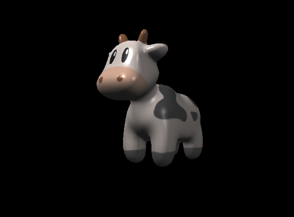

# Rasterized Rendering
Blinn-Phong Shader

Bump Mapping

Displacement Mapping

Texture

# Path Tracing

# Thanks
This project is based on code skeletons from [Lingqi Yan](https://sites.cs.ucsb.edu/~lingqi/index.html)